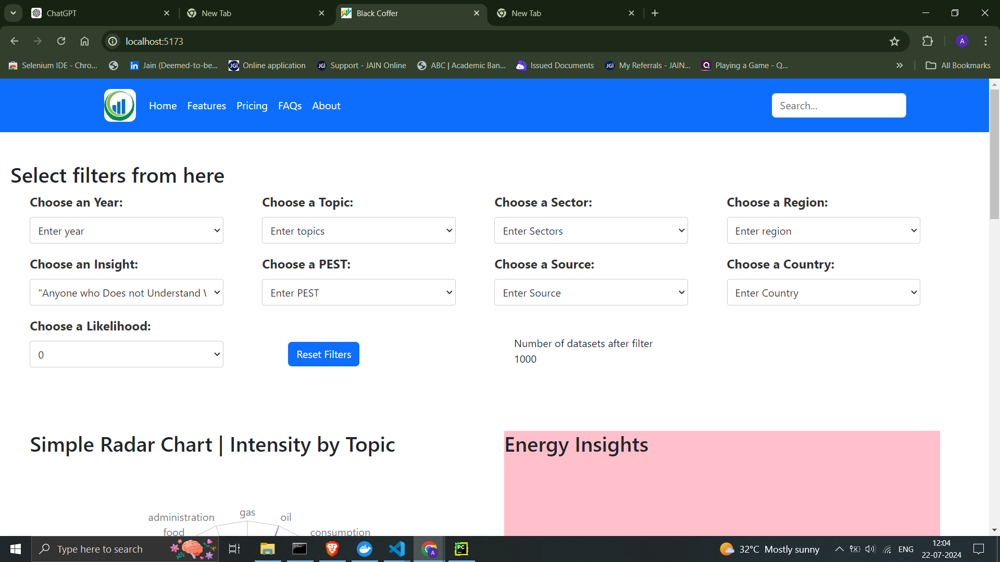

# Visualization Dashboard

## Tools and Techniques Used

1. Front-end:
   React
   Recharts library for building graphs
   Port: 5173
2. Database:
   MySQL
   Database Name: Dashboard
   Port: 3312
3. Backend:
   Python
   Django framework
   API endpoints:
   /load_data: Loads JSON data into the database
   /get_data: Retrieves data for frontend display
   Port: 8000

## Deployment

This project is containerized using Docker for easy deployment and management of services.

### Deployment Services :

1. Backend
2. Database
3. Frontend

### Docker hub repositories link 
   https://hub.docker.com/repositories/ankitak012

### Docker Deployment :

1. Docker should be installed in your system
   Note: The project includes a Dockerfile for each services, to run the project, use below command:

   `docker-compose up`

### Kubernetes Deployment :

1. Go to the k8s folder and run this command.

   `kubectl apply -f <file-name>`

2. Run the command show to visual dashboard

   `minikube service backend-service --url`

   When you run this command, you will get a link, and then you will need to enter that link into the browser.

   `<ip address>/load_data`

   `<ip address>/get_data/`

   `minikube service frontend-service --url`

## Accessing the project :

1. Load Data Endpoint:
   `http://127.0.0.1:8000/load_data` (To insert data into the database)

  
   &nbsp;
   
2. Get Data Endpoint:
   `http://127.0.0.1:8000/get_data/` (To retrieve data in JSON format)

   
   &nbsp;

3. Dashboard Endpoint:
   `http://localhost:5173/` (To access the visualization dashboard)

   

   
   &nbsp;

4. #### Dashboard Filters

   Use the 'Select options' feature. When choosing 'Social' under 'Choose a PEST'.
   

   

   

   

   

## Project Documentation

Ensure that all components and functionalities are correctly implemented as per the outlined requirements. Document the structure, setup instructions, and API details clearly for future reference and maintenance.

